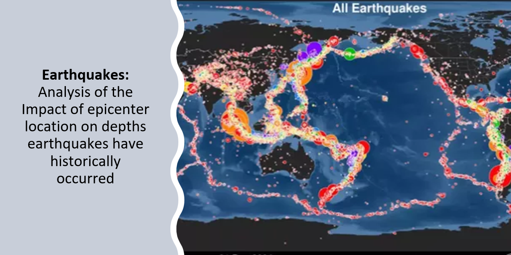
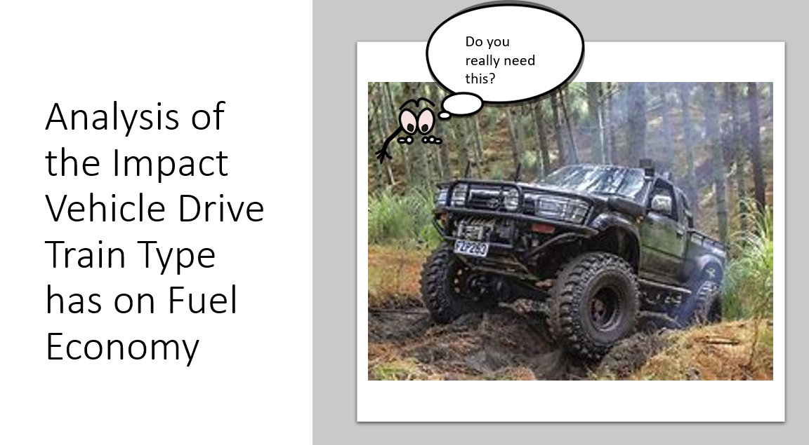

# TIdol.github.io
<!DOCTYPE html>
<html lang="en">

<head>
  <meta charset="UTF-8" />
  <meta name="viewport" content="width=device-width, initial-scale=1.0" />
  <link rel="shortcut icon" type="image/png" href="./images/favicon.png" />

  <!-- Put your site title here -->
  <title>
    Tami Idol | Data Analyst
  </title>

  <meta name="description" content="Data analyst proficient in creating dashboards, tracking performances,  Pandas, Excel, SQL, Tableau, and Python to transform data into meaningful and easily understood visualizations and presentations. Previously worked in the software development field on a contract basis and have had managerial experience through various employment opportunities.">
  <!-- Add some coding keywords below, Ex: (React, CSS etc) -->
  <meta name="keywords" content="Proficiency: Python, Microsoft Excel, Tableau, SQL, PostgreSQL, Microsoft PowerPoint, Visual Studio, ArcGIS, Git.
  Methods: Statistical analysis, data visualization, presentation design, data cleaning, data discovery, Exploratory Data Analysis, data modeling, A/B testing, t-tests, project management, business strategy, business intelligence, report generation.                        
  " />
  <link rel="stylesheet" href="index.css" />
</head>

<body>

  <!-- ***** Header ***** -->

  <header class="header" role="banner" id="top">
    

      <nav class="nav" role="navigation">
        <ul class="nav__items">
          <li class="nav__item"><a href="#work" class="nav__link">Work</a></li>
          <li class="nav__item">
            <a href="#about" class="nav__link">About</a>
          </li>
          <li class="nav__item">
            <a href="#clients" class="nav__link">Dashboards</a>
          </li>
          <li class="nav__item">
            <a href="#contact" class="nav__link">Contact</a>
          </li>
        </ul>
      </nav>
    

    

      

        <h1 class="heading-primary">
          <!-- Replace the following name with your name -->
          Tami Idol
        </h1>
        <!-- Put a small paragraph about yourself -->
        
Data Analyst 

        <a href="#contact" class="btn btn--pink">Get in touch</a>
      

    

  </header>

  <main role="main">

    <!-- ***** Work ***** -->

    <section class="work" id="work">
      

        <h2>My Work</h2>
        

          <!-- Each div with the work__box class is a project. -->

          

            

              <h3>Analysis of Historical Earthquakes</h3>
              

                Data from the National Earthquake Information Center (NEIC) , including the date, time, location, depth, magnitude, and source of every earthquake with a reported magnitude 5.5 or higher from 1965 to 2016. This research will look at historical earthquake data to determine if correlations or differences in statistical means exist between locations, depths, and magnitudes to provide insight into future prediction and risks.
              

              <ul class="work__list">
                <li>Python</li>
                <li>Pearson-R Testing</li>
                <li>Pandas</li>
                <li>Seaborn</li>
                <li>Numpy</li>
                <li>Scipy</li>
              </ul>

              

                <a href="https://docs.google.com/presentation/d/1Igaf4XODJkmTxuZ8YWwVkjNgMrTmqcI2/edit?usp=share_link&ouid=110698164032505747451&rtpof=true&sd=true">
                  View Presentation &rarr;
                </a>
                
              

            

            

              
            

          

          

            

              <h3>Fuel Economy Factors</h3>
              

                A data backed analysis and reccomendations about vehicle fuel economy. Offering advice around vehicle drive train types (4WD vs 2WD) and how those might drive fuel economy/annual fuel costs.
              

              <ul class="work__list">
                <li>T-Testing</li>
                <li>Statistical Analysis</li>
                <li>Excel</li>
                <li>Pivot Tables</li>
              </ul>

              

                <a href="https://docs.google.com/presentation/d/1cKwTNVYc9TuVz60U6PkDcAnAzo0vb1BT/edit?usp=sharing&ouid=115898290739699555854&rtpof=true&sd=true" class="link__text">
                  View Presentation &rarr;
                </a>
                
              

            

            

              
            

          

          

            

              <h3>Revenue Growth Model</h3>
              

                Examined and cleaned historical sales data, completed exploratory analysis to identify strategic scenarios to increase revenue. Presented models that showcased a 20% increase in profits while lowering or maintaining operational costs.
              

              <ul class="work__list">
                <li>X-Lookup</li>
                <li>Excel</li>
                <li>Modeling</li>
                <li>Business Strategy</li>
              </ul>

              

                <a href="https://docs.google.com/presentation/d/1IkUvmbOJyoRVrcWxG0cgmNk1SST8WbSf/edit?usp=share_link&ouid=110698164032505747451&rtpof=true&sd=true" class="link__text">
                  View Presentation &rarr;
                </a>
                
              

            

            

              
              
            

            

          

        

    </section>
  

<section>
  
 

To preview more of my dashboards see Tableau link in contact.
 
 

</section>

<section class="client" id="clients">
      

        <!--<h2>Dashboards</h2>
        
<noscript></noscript><object class='tableauViz'  style='display:none;'><param name='host_url' value='https%3A%2F%2Fpublic.tableau.com%2F' /> <param name='embed_code_version' value='3' /> <param name='site_root' value='' /><param name='name' value='CensusData_16534912109300&#47;DynamicPopChange' /><param name='tabs' value='no' /><param name='toolbar' value='yes' /><param name='static_image' value='https:&#47;&#47;public.tableau.com&#47;static&#47;images&#47;Ce&#47;CensusData_16534912109300&#47;DynamicPopChange&#47;1.png' /> <param name='animate_transition' value='yes' /><param name='display_static_image' value='yes' /><param name='display_spinner' value='yes' /><param name='display_overlay' value='yes' /><param name='display_count' value='yes' /><param name='language' value='en-US' /></object>
                
         
        
<noscript></noscript><object class='tableauViz'  style='display:none;'><param name='host_url' value='https%3A%2F%2Fpublic.tableau.com%2F' /> <param name='embed_code_version' value='3' /> <param name='site_root' value='' /><param name='name' value='StrategicDashboard_16535129401400&#47;StrategicDashboard' /><param name='tabs' value='no' /><param name='toolbar' value='yes' /><param name='static_image' value='https:&#47;&#47;public.tableau.com&#47;static&#47;images&#47;St&#47;StrategicDashboard_16535129401400&#47;StrategicDashboard&#47;1.png' /> <param name='animate_transition' value='yes' /><param name='display_static_image' value='yes' /><param name='display_spinner' value='yes' /><param name='display_overlay' value='yes' /><param name='display_count' value='yes' /><param name='language' value='en-US' /></object>
                
         
        
<noscript></noscript><object class='tableauViz'  style='display:none;'><param name='host_url' value='https%3A%2F%2Fpublic.tableau.com%2F' /> <param name='embed_code_version' value='3' /> <param name='site_root' value='' /><param name='name' value='AnalyticDashboard_16535095533880&#47;Dashboard1' /><param name='tabs' value='no' /><param name='toolbar' value='yes' /><param name='static_image' value='https:&#47;&#47;public.tableau.com&#47;static&#47;images&#47;An&#47;AnalyticDashboard_16535095533880&#47;Dashboard1&#47;1.png' /> <param name='animate_transition' value='yes' /><param name='display_static_image' value='yes' /><param name='display_spinner' value='yes' /><param name='display_overlay' value='yes' /><param name='display_count' value='yes' /><param name='language' value='en-US' /></object>
                
       

      
    </section> 

    <!-- ***** About ***** -->

    <section class="about" id="about">
      

        <h2>About Me</h2>
        

          

            <!-- Replace the below paragraph with info about yourself -->
            

                Data analyst with over 20 years of experience. Proficient in creating dashboards, tracking performances, Pandas, Excel, SQL, Tableau, 
                and Python to transform data into meaningful and easily understood visualizations and presentations. Previously worked in the Geotechnical Engineering Instrumentation field. My strong communication skills and meticulous attention to detail enable me to act as a translator between technology and people. 
            

            <!-- Provide a link to your resume -->
            <a href="G:\My Drive\Thinkful\Careers\Thinkful Job apps\Tami-Idol-resume.docx" class="btn">My Resume</a>
          

          

            <!-- Add a nice photo of yourself -->
            
          

        

      

    </section>
  </main>

  <!-- ***** Contact ***** -->

  <section class="contact" id="contact">
    

      <h2>Get in Touch</h2>
      

        

          Are you looking for a data backed analysis to
          represent your product or business? 
          The quickest way to reach out to me is via an email.
          You can also send a LinkedIn message 😊 
        

        <!-- Replace the email with yours -->
        <a href="mailto:tlidol007@gmail.com" class="btn">tlidol007@gmail.com</a>
      

    

  </section>

  <!-- ***** Footer ***** -->

  <footer role="contentinfo" class="footer">
    

      <!-- Update the links to point to your accounts -->
      <ul class="footer__social-links">
        <li class="footer__social-link-item">
          
        </li>
        <li class="footer__social-link-item">
          
          <li class="footer__social-link-item">
            
          </li>
        </li>
      </ul>

  
  
</body>

</html>
